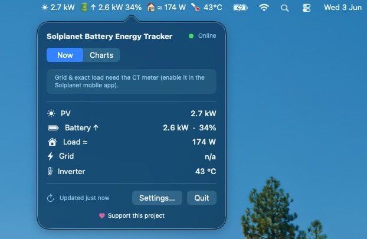

<div align="center">

# ☀️🔋 Solplanet Battery Energy Tracker

**Your solar inverter, live in the macOS menu bar.**

PV production, battery charge, house load and grid flow — read straight from your
Solplanet / AISWEI dongle on your local network, with history and charts. No cloud,
no account, read-only by design.


</div>

---

## ✨ What it does

- **Live in your menu bar** — a glanceable label like `☀ 1.4 kW  🔋↑ 820 W 64%  🏠 310 W`, fully configurable.
- **Energy popover** — PV, battery (power · SOC · direction), house load, grid and inverter temperature at a glance, with a health banner.
- **History & charts** — PV, battery power, SOC, load and grid over **6h / 24h / 7d / 30d / all**, with gap-aware lines.
- **Local & private** — talks only to your dongle's local API. Nothing leaves your network; no cloud, no login.
- **Read-only & safe** — it never writes to the inverter, and **never polls faster than every 5 seconds** (the dongle can brick under tight polling).
- **Manual refresh** — a one-click ↻ in the popover when you can't wait for the next tick.



---

## 📦 Installation

### Homebrew (recommended)

```sh
brew tap ealliaume/tap
brew install --cask solplanet-energy-tracker
open "/Applications/Solplanet Battery Energy Tracker.app"
```

From then on **the app updates itself**: it checks GitHub for new releases at
launch and every six hours, and the popover offers an **Install** → **Restart**
flow (it runs `brew upgrade --cask` for you when installed via the tap, or
downloads and swaps the bundle otherwise). You can also `brew upgrade --cask
solplanet-energy-tracker` by hand.

### App won't launch — *"Apple could not verify…"*

The app is ad-hoc signed, so macOS Gatekeeper blocks the first launch with a
warning like **"Apple could not verify 'Solplanet Battery Energy Tracker' is free
of malware…"**. Pick whichever is easiest:

**Right-click open (easiest)** — In Finder, locate the app, right-click it →
**Open** → **Open** in the dialog. macOS remembers the approval; it launches
normally from then on.

**System Settings** — After a blocked launch: **System Settings** → **Privacy &
Security** → scroll down → click **Open Anyway**.

**CLI — strip the quarantine flag**:

```sh
xattr -dr com.apple.quarantine "/Applications/Solplanet Battery Energy Tracker.app"
```

For a cask install the quarantine attribute comes from the download. Clear it,
then launch:

```sh
xattr -cr "/Applications/Solplanet Battery Energy Tracker.app"
open "/Applications/Solplanet Battery Energy Tracker.app"
```

### Build from source

```sh
./scripts/build-app-bundle.sh
open "dist/Solplanet Battery Energy Tracker.app"
```

This produces an ad-hoc-signed, menubar-only `.app` you can drag into
`/Applications`. Cutting a release is one command — see
[docs/how-to/how-to-release.md](docs/how-to/how-to-release.md).

---

## 🚀 First launch

1. Click the menu-bar item → **Settings…**
2. In **Connection**, enter your dongle's **IP address** and inverter **serial number**
   (scheme/port are under defaults — `https` works for most units; some firmwares use `http` on port `8484`).
3. Hit **Test connection** — you'll see a live battery % and PV reading if all is well.
4. **Save**. The menu bar starts updating on its own.

> Prefer the keyboard? You can pre-seed a dongle before opening Settings with the
> `SOLPLANET_TRACKER_HOST` and `SOLPLANET_TRACKER_SN` environment variables.

---

## ⚙️ Settings

**Connection** — dongle IP, serial number, scheme (`https`/`http`), optional port, and a **Test connection** button that does one real round-trip and reports a friendly result.

**General**
- **Startup** — *Start automatically at login* (off by default).
- **Refresh** — poll interval slider, hard-floored at **5 s**.
- **Menu bar** — choose exactly what appears:
  | Metric | Options | Default |
  |---|---|---|
  | PV | on / off | **on** |
  | Battery | Watts · Percent · Both · Hidden | **Both** |
  | Load | on / off | **on** |
  | Grid | on / off | off |
  | Inverter temperature | on / off | off |

Changes to the menu-bar options apply **instantly**.

---

## 🔍 How it works

```
InverterPoller (every N ≥ 5 s, exponential backoff on errors)
   └─ SolplanetConnector — queries device 4 (battery), 2 (inverter), 3 (meter), serialized
        └─ derive PV = −pac, battery sign, meter-aware load/grid
   └─ readings.json (atomic write + flock)  +  append-only history JSONL (on change)
        └─ ReadingsStore (@Observable) → menu-bar label + popover + charts
```

The hard-won bits live in the connector. Notably, because the battery is **AC-coupled**,
PV generation is derived as `PV = −pac` (the inverter's AC output already includes the
battery-charging power) — **not** `−(pb + pac)`, which double-counts and roughly doubles
the result. See [`docs/solplanet-api-documentation.md`](docs/solplanet-api-documentation.md).

---

## 🩺 Health & accuracy

The popover surfaces an honest banner when:

- **Offline** — the dongle is unreachable; the last good reading stays, dimmed.
- **Stale** — the reading is older than expected.
- **Error** — the inverter reports an error code.
- **No CT meter** — without the grid current-transformer meter, **grid is unavailable** and **house load is approximate** (shown with a `≈`), because it's a noisy difference of two large, asynchronously-sampled values.

---

## 🎨 Colors & tiers

Semantic tiers drive accents (and, soon, per-segment menu-bar colors):

| Metric | Tiers |
|---|---|
| SOC | `<15%` critical · `15–40%` warning · `40–80%` info · `>80%` good |
| Battery | charging → good · discharging → warning · idle → neutral |
| Grid | export → good · import → critical · idle → neutral |

---

## 🗂️ Data locations

Everything lives under `~/.cache/solplanet-energy-tracker/`:

| Path | Contents |
|---|---|
| `readings.json` | latest reading per inverter (atomic write, advisory `flock`) |
| `history/YYYY/MM/YYYY-MM-DD.jsonl` | append-only snapshots, one line per change |

The same `readings.json` is what the bundled `scripts/battery_status.sh` debugging tool reads.

---

## 🛠️ Build from source

Requirements: macOS 14+, Xcode 26 / Swift 6.

```sh
cd SolplanetEnergyTracker
swift build      # compile
swift test       # run the suite

# Package a distributable .app (renders the icon, signs ad-hoc):
cd ..
./scripts/build-app-bundle.sh
```

---

## 🧑‍💻 Development

- **Swift package** lives in `SolplanetEnergyTracker/` (a library target + a thin menubar executable).
- **Engineering rules** are mandatory and documented under [`docs/guidelines/`](docs/guidelines) — concurrency, error handling, I/O robustness, testability, value objects, and menu-bar specifics. Start at [`CLAUDE.md`](CLAUDE.md).
- **Tests** cover the derivations (including the high-PV regression), persistence, the poller's backoff/offline behaviour, and the menu-bar formatting.

---

## ❤️ Support this project

If this saves you a trip to the inverter app, consider sponsoring its development:

<div align="center">

### 👉 [**Sponsor on GitHub**](https://github.com/sponsors/ealliaume)

</div>

---

<div align="center">

### 🙏 Thank you

This project stands on the shoulders of **[AI Usages Tracker](https://github.com/fcamblor/mac-ai-trackers/)**
by [@fcamblor](https://github.com/fcamblor) — its architecture, tooling and engineering
rules were the blueprint for this app. Huge thanks for paving the way. 💛

</div>
